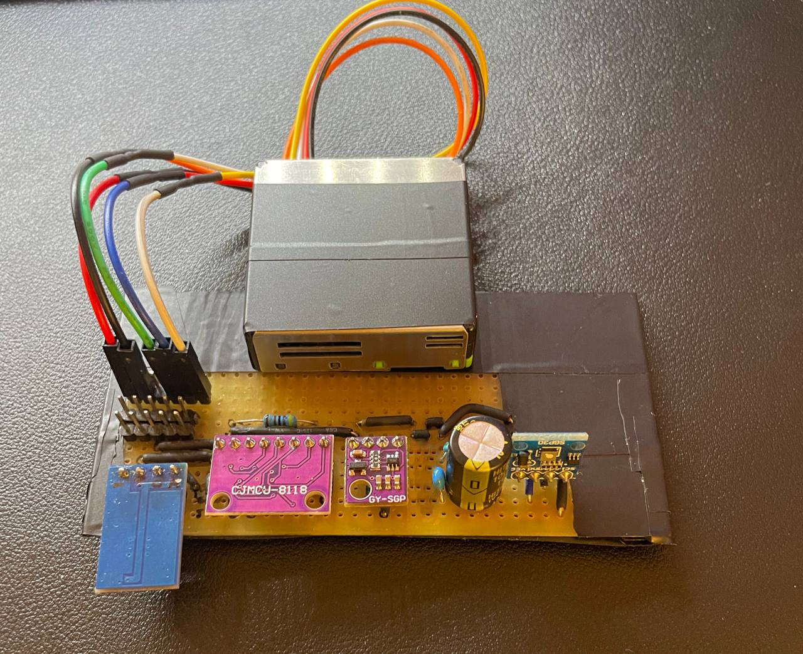
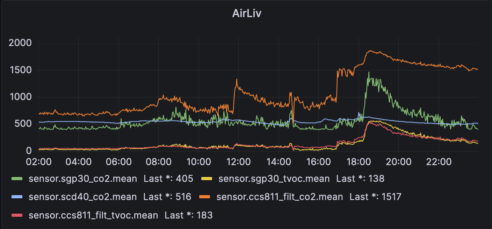
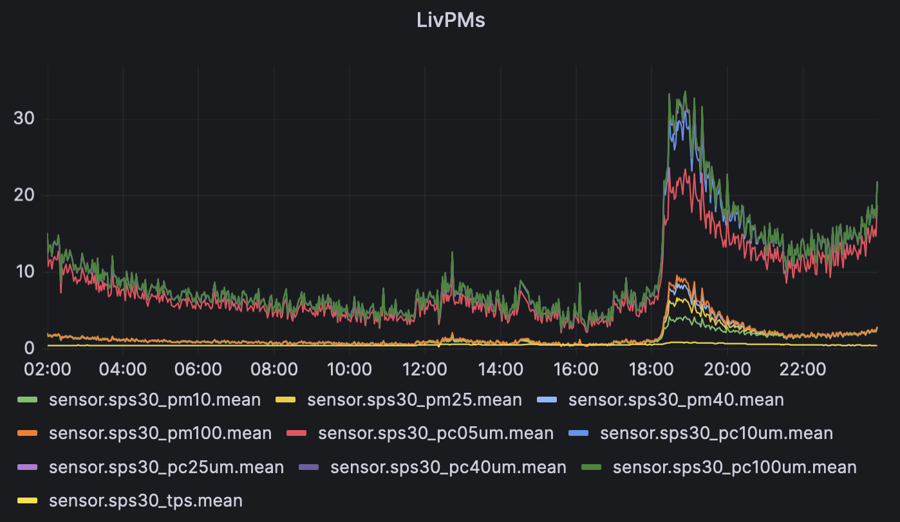

# Sensing library

Sensei Smart Home monitoring tools. Currently aimed at air quality monitoring.

Sensei samples connected sensors, sending readings over MQTT to a connector place (MQTT server part not included).
[Home Assistant](https://www.home-assistant.io/) and Grafana can be setup to collect sensor readings.

[](docs/img/sensor-board-fixed.jpg)
[](docs/img/grafana-liv.png)
[](docs/img/grafana-pm.png)

Supports:
- Python (RPi / busio)
- [Micropython] (ESP32)

with the same code.

Supported sensors, connected over I²C bus:
- [SGP30] TVOC & eCO2 sensor (ethanol, H₂). CO2 is not measured directly, estimated based on Ethanol/H₂. Now end of life. Successor: SGP4x.
- [SGP41] TVOC & NOx sensor (2 pixel-arrays, MOx, ethanol / NO₂), post-processing via [Sensirion Gas Index Algorithm](https://github.com/ph4r05/ph4-sensirion-gas-index-algorithm-py)
- [CCS811] Metal oxide (MOX) gas sensor to detect a wide range of Volatile Organic Compounds (VOCs). Produces: VOC (eTVOC) and equivalent CO2 (eCO2) values, where the main cause of VOCs is from humans.
- [SCD41] High CO₂ accuracy with extended measurement range and low power modes. Measures CO₂ directly.
- [ATHx0] Temperature and humidity sensor
- [HDC1080] Temperature and humidity sensor, often paired with CCS811 chip on a single board
- [SPS30] laser-based particular matter detector, PM1, PM2.5, PM4, PM10. Supports both I²C and UART.
- [ZH03b] laser-based particular matter detector, PM1, PM2.5, PM4, PM10 (SPS30 seems to be better). Support UART only.

## Practical use
Config file `config.yaml` defines basic sensei settings, such as connected sensors.

### Raspberry PI
For installation on Raspberry PI, this library can be installed with pip. Python 3.10 is recommended.

Directory [isense_py](isense_py) demonstrates use of this library with RPi. Create custom `config.yaml` from
`config-example.yaml`. Calling `install.sh` installs the library as a service.

### ESP32
Sensei works also on ESP32 running Micropython. It can be copied to the board using [VSCode and PyMakr](https://randomnerdtutorials.com/micropython-esp32-esp8266-vs-code-pymakr/).

Copy [ph4_sense](ph4_sense) as-is to ESP32, then copy instance setting directory, such as [isense_esp32_test](isense_esp32_test)
to the root, i.e., `./main.py` is present on ESP32.

ESP32 config is json (yaml not supported). ESP32 supports connecting to the WiFi, you have to thus specify SSID and Passphrase to connect to.

## Circuitry

### Pull-up resistors
I²C bus requires [pull-up](https://rheingoldheavy.com/i2c-pull-resistors/) resistors to operate correctly.
By default, pull-up pulls SDA and SCL lines to logical 1, sensors then pull line to the ground to change state to 0.

If the pull-up resistor is too high, signal recovers from 0 to 1 too slowly. If resistor is too low, current flowing through
the sensor when transmitting 0 may be too high and either damage the sensor or cause unreliable communication.

Almost all sensor boards available on the market usually already contain 10k pull-up resistors.
The problem is when connecting more sensors to a single I²C bus. Resistors form a parallel resistor circuit, lowering
overall resistance. I.e., the whole setup stops working after reaching number of sensors.

$$ R_{\text{total}} = \frac{R}{N} $$

i.e., when 5 sensor boards are connected on the same bus, pull-up resistance is 2k, reaching borderline values.
To support more sensors, it is needed to remove external pull-ups from the sensor boards.

In case of SCD41 it is easy as pull-up is a single resistor. In others, disconnecting pull-ups is more tricky
as pull-up is part of a single SMD component containing 4 independent resistors.

Gently reminder on a formula for parallel resistors:

$$
\frac{1}{R_{\text{total}}} = \frac{1}{R_1} + \frac{1}{R_2} + \frac{1}{R_3} + \ldots + \frac{1}{R_n}
$$

### Capacitance
I²C has capacitance limit 400 pF. With higher values, speed of voltage transition degrades, causing bus to be unreliable.

For sensing purpose it is recommended to use lower bus speeds, e.g., 100k HZ. Lower the frequency, higher the tolerance
to the capacitance.

Capacitance is inherent to the circuit (parasitical capacitance), each new board and sensor increases the capacitance (signal traces length, PCB material, chip capacitance).
Higher capacitance can be into some degree compensated with lower pull-up. But after some limit, bus reaches maximum capacity and no new sensors can be added.

### Bus segmentation
If more sensors needs to be connected to a single bus, or it is needed to combine sensors operating on various bus speeds
or voltages, the following can be used:

- Bus repeaters [PCA9515A](https://www.nxp.com/docs/en/data-sheet/PCA9515A.pdf). While retaining all the operating modes and features of the I²C-bus system, it permits extension of the I²C-bus by buffering both the data (SDA) and the clock (SCL) lines, thus enabling two buses of 400 pF.
- Bus multiplexers [TCA9548A](https://www.ti.com/lit/ds/symlink/tca9548a.pdf). More powerful than bus extender. Also enables to connect multiple devices with the same address.
- Level shifters: When adding another sensors operating on different voltage levels, a [level shifter](https://cdn-shop.adafruit.com/datasheets/an97055.pdf) may be needed for 3.3V and 5V sensors to operate on the same I²C bus.

## UdpLogger

Sensei supports simple UDP logging to a remote server to make debugging easier, e.g., when running on ESP32.

Start UDP logger on the server side:

```bash
while true; do nc -ul 9998; done
```

## Alternative python installation

```bash
sudo apt update && sudo apt upgrade -y
sudo apt install build-essential zlib1g-dev libncurses5-dev libgdbm-dev libnss3-dev libssl-dev libreadline-dev libffi-dev libsqlite3-dev wget libbz2-dev
wget https://www.python.org/ftp/python/3.10.12/Python-3.10.12.tgz
tar -xf Python-3.10.*.tgz
cd Python-3.10.*/
./configure --prefix=/usr/local --enable-optimizations --enable-shared LDFLAGS="-Wl,-rpath /usr/local/lib"
make -j $(nproc)
sudo make altinstall

python3.10 --version
```

## Dependencies

Repository has directly included Sensirion gas index algorithm for ease of deployment to ESP32: https://github.com/ph4r05/ph4-sensirion-gas-index-algorithm-py

## Development

Install pre-commit hooks defined by `.pre-commit-config.yaml`

```shell
pip3 install -U pre-commit
pre-commit install
```

Auto fix
```shell
pre-commit run --all-files
```

Plugin version update
```shell
pre-commit autoupdate
```

[Micropython]: https://micropython.org/
[SGP30]: https://sensirion.com/products/catalog/SGP30/
[SGP41]: https://sensirion.com/media/documents/5FE8673C/61E96F50/Sensirion_Gas_Sensors_Datasheet_SGP41.pdf
[SCD41]: https://sensirion.com/products/catalog/SCD41
[CCS811]: https://www.sciosense.com/wp-content/uploads/2020/01/SC-001232-DS-2-CCS811B-Datasheet-Revision-2.pdf
[ATHx0]: https://cdn.sparkfun.com/assets/d/2/b/e/d/AHT20.pdf
[HDC1080]: https://www.ti.com/lit/ds/symlink/hdc1080.pdf
[SPS30]: https://sensirion.com/media/documents/8600FF88/616542B5/Sensirion_PM_Sensors_Datasheet_SPS30.pdf
[ZH03b]: https://www.winsen-sensor.com/d/files/zh03b-laser-dust-module-v2_1(2).pdf
